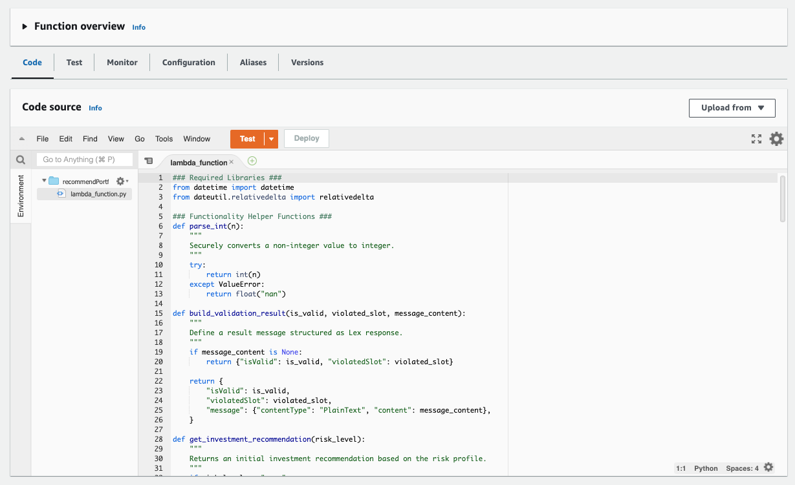
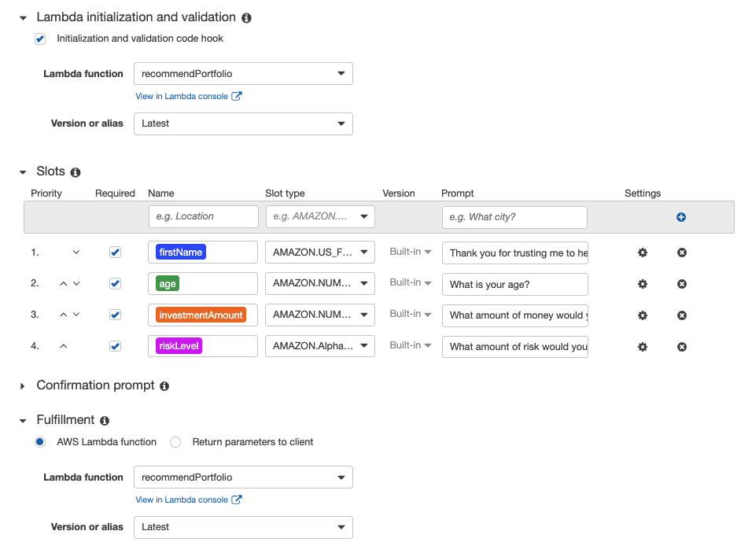
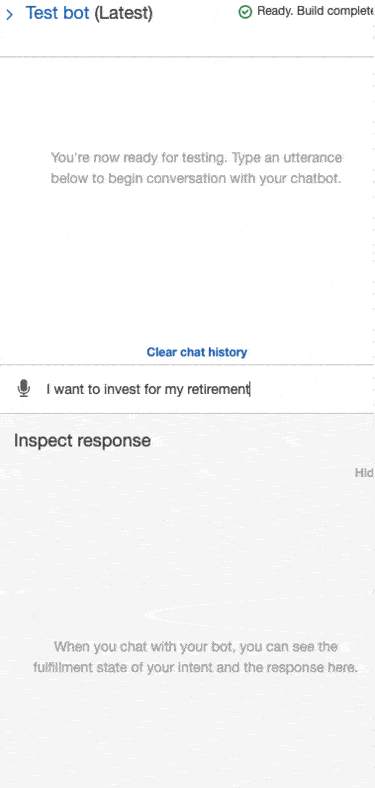
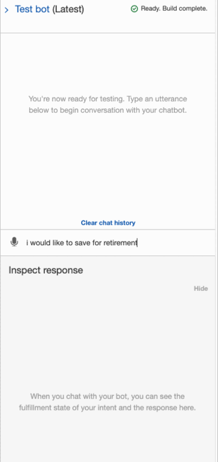

# AWS_Lex_Lambda_RoboAdvisor

This is an [Amazon Web Services (AWS)](https://aws.amazon.com/) Lex V1 Console robo advisor bot. It works with AWS Lambda to gather personal information from a user in order to make an investment portfolio recommendation for them via the Amazon Lex chat feature.

---

## Installation Guide

Please [click here](https://aws.amazon.com/premiumsupport/knowledge-center/create-and-activate-aws-account/) to learn how to set up your AWS account.

---

## Usage

Create an AWS Lambda function.

Copy and paste the python code from the `aws_robo_advisor_lambda_function.py` file into the "Code" area. See an example image below.

Create an Amazon Lex V1 Console bot. To be sure you're in the V1 console, after clicking "Amazon Lex", click "Return to the V1 console" in the left menu bar.

When creating the intent for your bot, be sure to add the correct slots and to apply the AWS Lambda function as shown in the images below.

Without the AWS Lambda code added to the Amazon Lex bot, you will receive the following response from the bot:

After adding the AWS Lambda code to the Amazon Lex bot, you will receive the following response from the bot:

This is the desired outcome.

---

## Contributors

[Rachel Ann Hodson](https://www.linkedin.com/in/rachelannhodson/)
rachelannhodson@gmail.com

---

## License

MIT